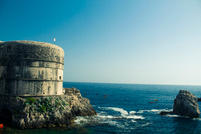
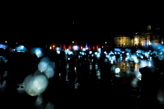
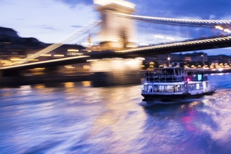
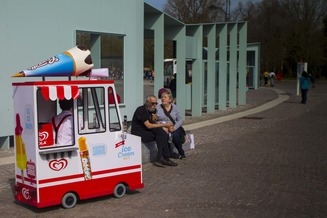

# Aaron Traynor

## A Brief Introduction

Hey - Aaron here! :wave: I've just finished my CompSci degree at [KCL](https://www.kcl.ac.uk) and can't wait to get started with my career as a developer.

### Where did I work before?

While I've been at uni, I've been working part-time in IT support for a Healthcare & Life Sciences [Venture Capital firm](https://svhealthinvestors.com/) (they're doing some really cool stuff - [check it out](https://www.cancerresearchuk.org/about-us/cancer-news/press-release/2019-07-02-cancer-research-uk-forms-collaboration-with-sv-health-investors-to-accelerate-development-of-cancer)!). I've had a blast and worked with some amazing people, but it's time for me to move into something more exciting and challenging.

### A bit more about me

I'm just getting started with development in an industry setting and I can't wait to start putting my skills into practice, but please do be patient with me if I ask questions that you might think are straightforward - I'm still new to all this! :baby:

Outside of work, I really love photography (shameless plug to my [Instagram](https://www.instagram.com/atraynor97/) if you're interested). I *love* to get creative with lighting at night (light trails are one of my favourite things to shoot :grin:), or capture the beautiful architecture and stunning landscapes of the places I travel to. Here's a few of my most favourite shots below!

   

